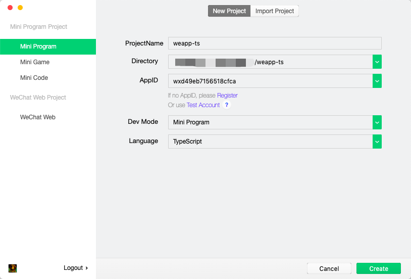
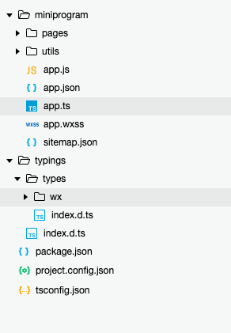
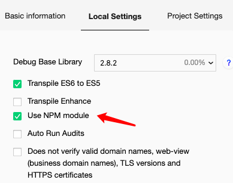
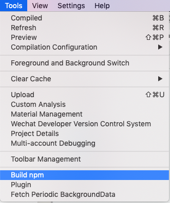
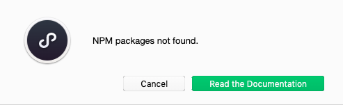
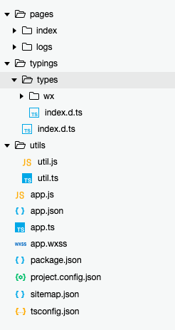

# 微信小程序开发系列 - Typescript开发实践

Typescript目前非常流行，很多最新的js框架已逐渐迁移或选用Typescript开发，例如大名鼎鼎的VS Code就是使用Typescript开发。

虽然最新版的微信开发者工具也开始支持Typescript开发，但是在实际开发过程中，仍然遇到不少坑，这里主要讲述以下如何配置开发环境，并让微信小程序的开发既支持Typescript，又支持npm。

## 1. 项目结构

首先，我们使用微信开发者工具工具创建一个项目，设置如下图所示：



创建成功后，目录结构如下图所示：



新版的开发者工具把`node_modules`文件夹隐藏了，开发者无法在开发者工具中直接查看或编辑。

## 2. 开启npm支持

打开项目详细设置选项卡，并勾选npm module选项



然后选择`Tools工具 > Build npm 构建npm`



此时开发者工具会弹出一个提示“npm package not found”



我们项目明明又一个`node_modules`文件夹，也有`package.json`的配置文件，为什么会产生这个提示呢？其实这个问题的原因是开发者工具会在`miniprogramRoot`中搜索是否有`package.json`配置文件，而我们初始化的项目却在`miniprogramRoot`的上一级目录创建了`package.json`的配置文件，所以导致无法找到npm package的错误。

知道问题后，解决这个问题就是需要把`miniprogramRoot`设置为项目的根目录，这样就可以共享项目根目录的配置文件。

改造后的项目结构目录如下图所示：



我们再尝试运行build npm，构建没有出现刚才的问题。顺利生成一个新的文件夹`miniprogram_npm`。

## 3. 添加npm包依赖

项目模版默认会复制一个微信API的typings文件夹，作为API接口的类型声明，但是`package.json`中又引用了`miniprogram-api-typings`依赖包，如果我们运行了`npm i`，那么编译的时候，会出现错误，因为`typings`文件夹的接口定义与`miniprogram-api-typings`的定义相冲突。

解决办法有两个，第一是删除`package.json`中的`miniprogram-api-typings`引用，但是缺点就是当typings升级后，需要手动更新typings文件夹中的内容；另外一个是，删除typings文件夹，使用`miniprogram-api-typings`依赖，好处自然就是可以通过npm方便的升级，但是会引入另外一个问题，就是微信开发者工具无法识别`node_modules`目录下的typings定义，导致自动补全功能无法使用，不过我们仍然可以通过VS Code来实现自动代码补全。具体取舍，下面会进一步阐述。

下一步我们尝试添加一个npm依赖包，看看是否可以顺利。此处我们使用的是[vant-weapp](https://github.com/youzan/vant-weapp)


按照官方文档，执行添加命令：

```
npm i @vant/weapp -S --production
```

执行完成后，尝试运行编译:

```
npm run tsc
```

此时出现多个编译错误

```
miniprogram_npm/@vant/weapp/common/utils.d.ts:1:23 - error TS2688: Cannot find type definition file for 'miniprogram-api-typings'.

1 /// <reference types="miniprogram-api-typings" />
```

`vant-weapp`这个库依赖于`miniprogram-api-typings`这个包，而如果我们使用上面提到的第一种方法，就导致无法编译`vant-weapp`这个库，所以我们只能采取第二种方法，通过npm来安装typings：`miniprogram-api-typings`

此时，我们就需要同时修改`tsconfig.json`文件中`typeRoots`设置:

```
"typeRoots": [
    "./node_modules/miniprogram-api-typings"
]
```

至此，我们的项目框架已修改完毕，此时，我们可以通过typescript来开发小程序应用。唯一不足的就是，微信开发者工具中无法识别微信的typings，所以只能通过VS Code来开发，通过开发者工具来调试。

具体的项目模版，可以参考我的[github repo](https://github.com/enix223/weapp-ts/tree/master)
